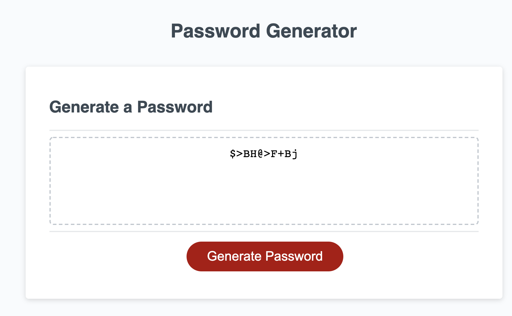

# Password Creator
The following challenge was to generate a password through a series of prompts, starting with asking for the length of a password. It will generate this random password, so that users can be able to create a password that is considered strong.

It will ask for the length of characters between 8 and 128 characters, lowercase, uppercase, numeric, and/or special characters. 

# Screenshot
The below shows results of the project.

# Link to deployed applicatoin
https://christine-zhe.github.io/pw-creator/
